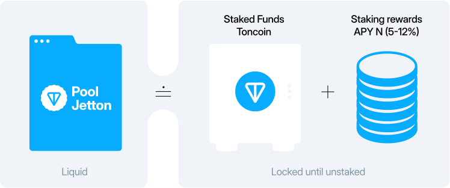

# What is Liquid Staking on TON?

TON Liquid Staking (LSt) is a protocol that allows TON holders of all caliber to participate in TON Blockchain validation through assets pooling.

Stakers, also known as Nominators, are TON holders who stake their funds in a pool to be used for validation. In other words, these are users who nominate a pool to exercise their validation rights.

Rewards in TON LSt protocol essentially come from validation rewards, however technically on the Pool level it comes from interest payments from validators that lend funds for staking.

In exchange for staking Toncoin using TON LSt protocol stakers receive a liquid staking receipt token called Jetton Pool.&#x20;

The Jetton Pool token defines the current volume of staked funds in a pool for all users making use of the pool. During this time, the ratio of Jetton Pool to TON increases due to rewards shared for each validation cycle. As a result, stakers can claim their accrued rewards by exchanging their Jetton Pool for TON as an incentive for using the platform.&#x20;

<figure><figcaption></figcaption></figure>

Lending on TON Blockchain offers an opportunity for Stakers (Nominators) and TON Ecosystem participants (Validators) to connect their funds and hardware to the network’s validation process to contribute to network voting. At the heart of the protocol is the Pool contract. This contract allows users to lend their funds on interest to a liquidity pool without a direct transfer to borrowers.

##
